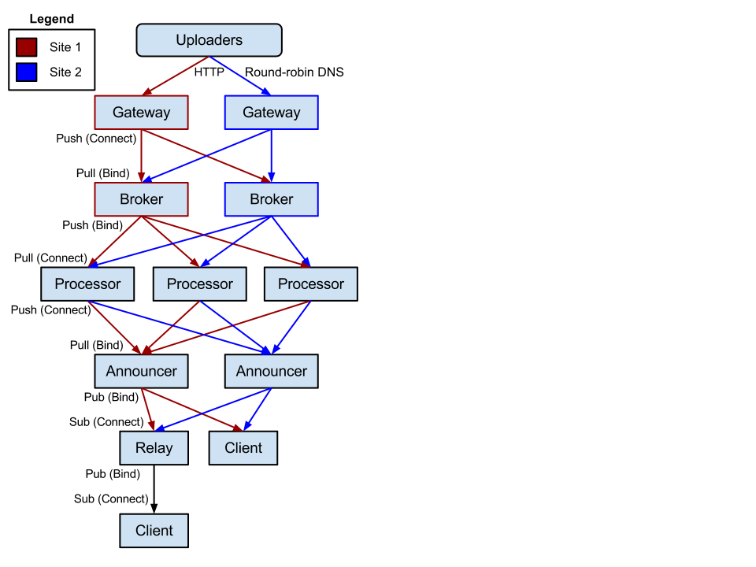

.. _overview:

.. include:: global.txt

A High-Level Overview
=====================

Project Motivation
------------------

**For the application developer**, there are quite a few
barriers to entry for those wishing to write market-data-driven applications.
A developer would probably need to:

* Either write their own uploader client, or re-purpose an existing uploader.
* Write a service/API to accept the data in whatever format(s) the uploader(s)
  they'd like to support use.
* Actually get players to point their uploader at said service/API (This is the
  hardest part!)
* Probably pull data from other market sites to flesh out their data set.
* Then, and only then, start writing the *fun* part of their application as
  the amount of data coming in slowly grows. By this point, they are probably
  a ways down the road to burnout.

None of these tasks are fun, they all involve re-inventing the wheel. By the
time the developer gets through these, burnout may be a real possibility.

**For current market-driven sites**, the need to patch together scripts to
pull data from the other various market sites is tedious, boring, and will
often resource-intensive for both parties (downloader and the API being
downloaded from).

**In both cases (current, or prospective developers/sites)**, EVE Market
Data Relay (EMDR) allows you to forgo all of this drudgery, and instead,
connect to a firehose of data in the standardized
`Unified Uploader Interchange Format`_ format. Additionally, EMDR is distributed
and highly available, making the likelihood of failure very slim.

Core Principles
---------------

During the early design and development of EMDR, these were the main pillars
we built on:

* There should be no single point of failure. Every component of the
  architecture should be simple to make redundant using trusted volunteered
  machines.
* The application must be able to accept an extremely large number of incoming
  market orders without performance issues.
* The cost for people hosting parts of EMDR's network should be kept to an
  absolute minimum. This means being stingey with CPU, RAM, and bandwidth.
  Likewise, consuming the feed shouldn't break the bank, either.
* It must be very easy to scale the system without restarts/reconfigs on the
  primary setup.
* The broadcasting of the market data needs to happen in a "fan out" manner.
  In this way, we can keep adding additional subscribers without running into
  scalability issues.

How it all fits together
------------------------

For any given submitted market order, here is the flow said order goes through::

    (Gateway) -> (Announcer) -> (Relays) -> (Applications)

First, the order hits the **Gateway**, which is a simple HTTP application
that parses the message. Incoming messages can be in a number of different
formats (EVE Marketeer/EVE Marketdata, Unified Uploader Format, etc).

The Gateway interprets the message, then converts it to
`Unified Uploader Interchange Format`_. The converted message is then handed
off to all of the **Anouncers** in the network.

The **Announcer** is the first tier of our market data distribution.
As market messages arrive, they are sent out to all **Relays** that are
connected to the Announcer. There are only a few Announcers, and these only
accept connections from approved Relays.

The **Relay** is a dumb repeater daemon. It takes the processed orders and just
spews them out to any subscribers. Subscribers can be other **Relay** daemons,
or actual user sites/applications. By hanging Relays below Announcers, and
having applications connect to the Relays, we keep bandwidth usage and costs
lower on the top-level Announcers. We are also able to keep "fanning out" to
allow more and more consumers to get the data without breaking the bank, or
putting massive load on a single server.

We are left with a very efficient, very sturdy data relay network. The next
section goes into detail about fault-tolerance.

High Availability through shared burden
---------------------------------------

EMDR is architected in a way that allows every single component to be
replicated. We can easily add additional daemons at each level of the stack in
order to increase throughput or availability.

Uploads are dispersed via Round-Robin DNS, which is a
simple way to distribute load across multiple machines. For each Gateway
in the DNS rotation, incoming bandwidth consumption drops for the whole pool
as the load is divided. If at any time one of the gateways becomes unreachable,
it is automatically removed from the DNS rotation.

In the diagram below, we see what will be our initial deployment. Site 1 is
comprised of EMDR running on Greg Taylor's (the project maintainer) machines,
and Site 2 will be running on a trusted party's machines that are in another
data center/region.

.. note:: We are not limited to just two instances of EMDR, there is no hard
    limit. Additionally, we'll mostly scale by adding more Gateways, since
    additional Announcers are only for redundancy.

At every step of the entire flow, we can afford to lose one of the two
daemons, with no service interruption. The infrastructure can be scaled well
out past the initial two sites, if need be.

Security
--------

Security is something we take seriously, but let's consider the current
reality of market data with EVE sites: *Players upload market data directly
to market sites.* We are no less secure than that. Uploads can be faked,
and malicious payloads can be sent, though EMDR will do its best to catch
anything harmful.

.. note:: As a consumer, you may wish to cross-reference incoming data. In
    many cases, you will get the same data point multiple times, as several
    players upload the same thing. This can be used to your advantage.

Technology Used
---------------

This is the least interesting part of the overview, so it goes towards the
ends.

* EMDR is written in Python_.
* All network-related stuff is handled by ZeroMQ_, which is an incredibly
  simple and performant networking library.
* gevent_ is used for their excellent greenlet-based Queue, Workers, and
  async network I/O.
* The gateway HTTP servers run bottle_.

The entire stack is super low overhead, and very fast.

Volunteering
------------

If you would like to volunteer computing resources to the EMDR network,
see :doc:`volunteering` for more details.